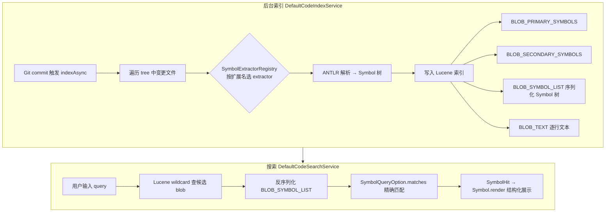

# Code Search & Symbol Indexing 调研

OneDev 的「File and Symbol Search」并非全文 grep，而是 **预索引 + 语言感知符号提取 + 结构化渲染**。BuildX 当前为 MVP（正则 + 实时 tree walk），本文档记录 OneDev 实现机制与 BuildX 差距，供后续移植参考。

**OneDev 参考路径**

| 模块 | 路径 |
|------|------|
| 代码索引 | `references/onedev/server-core/src/main/java/io/onedev/server/search/code/DefaultCodeIndexService.java` |
| 代码搜索 | `references/onedev/server-core/src/main/java/io/onedev/server/search/code/DefaultCodeSearchService.java` |
| Quick Search UI | `references/onedev/server-core/src/main/java/io/onedev/server/web/page/project/blob/search/quick/QuickSearchPanel.java` |
| 搜索结果 UI | `references/onedev/server-core/src/main/java/io/onedev/server/web/page/project/blob/search/result/SearchResultPanel.java` |
| 源码视图 | `references/onedev/server-core/src/main/java/io/onedev/server/web/page/project/blob/render/source/SourceViewPanel.java` |
| 符号提取库 | [theonedev/commons](https://github.com/theonedev/commons) → `commons-jsymbol`（Maven：`io.onedev:commons-jsymbol`） |

**BuildX 现状**

| 模块 | 路径 |
|------|------|
| 符号搜索（regex） | `buildx-server/internal/git/symbols.go` |
| 文件/文本搜索 | `buildx-server/internal/git/service.go` |
| Search API | `buildx-server/internal/server/api/search.go` |
| Quick Search UI | `buildx-web/src/components/search/QuickSearchPanel.tsx`（**仅文件名**） |
| 高级搜索 / 结果 | `AdvancedSearchPanel.tsx`、`SearchResultPanel.tsx` |
| 源码高亮 | `buildx-web/src/components/onedev/SourceView.tsx`（CodeMirror 6，已有） |

---

## 1. OneDev 整体架构



**要点**

1. **预索引**：每个 project 在 storage 下维护 Lucene 索引（`index/`），按 commit 增量更新。
2. **两阶段符号搜索**：Lucene 粗筛候选文件 → 内存中对 Symbol 树精匹配。
3. **Quick Search 混合结果**：同一输入框依次查 primary symbol、文件名、secondary symbol（见 §4）。
4. **「语法高亮」分两层**：源码浏览用 CodeMirror；搜索列表用 Symbol 专属 Panel + CSS（见 §5）。

---

## 2. 符号提取：`commons-jsymbol`

独立库 [commons-jsymbol](https://github.com/theonedev/commons/tree/main/commons-jsymbol)，OneDev 通过 Maven 依赖引入。

### 2.1 机制

- 每种语言实现 `SymbolExtractor`，由 `SymbolExtractorRegistry.getExtractor(fileName)` 按扩展名选择。
- 底层使用 **ANTLR v4** 语法（例如 SCSS 有 `ScssLexer.g4` / `ScssParser.g4`；Go 有 `GolangExtractor` + `GoScanner`）。
- 解析输出 **Symbol 树**，节点类型因语言而异（如 Go 的 `FunctionSymbol`、SCSS 的 `SelectorSymbol`）。

### 2.2 Symbol 元数据（搜索与 UI 共用）

| 属性 | 用途 |
|------|------|
| `name` | 符号名 |
| `parent` / `getFQN()` | 命名空间（如 Go 包 `main` 下的 `func main()`） |
| `isPrimary()` | 主符号（类、函数、类型）优先于次符号（方法、字段、CSS 选择器等） |
| `isSearchable()` | 是否写入 Lucene 符号字段（部分 outline 用符号不参与搜索） |
| `isLocal()` / `isLocalInHierarchy()` | 跨文件引用匹配时是否排除 |
| `position` / `scope` | 源码平面坐标，用于跳转与 outline 高亮 |
| `render()` / `renderIcon()` | 搜索结果的结构化 Wicket 组件 |

### 2.3 已支持语言（commons-jsymbol 包结构）

`java`、`golang`、`python`、`cpp`、`csharp`、`php`、`r`、`scss`、`less`、`flowscript` 等（以 registry 反射加载的所有 `SymbolExtractor` 实现为准）。

### 2.4 索引写入（`DefaultCodeIndexService.indexBlob`）

对每个 blob（受 project「code analysis files」pattern 约束，且大小/行长有上限）：

1. 逐行写入 `BLOB_TEXT`（供文本搜索，NGram analyzer）。
2. 调用 `extractor.extract(blobName, content)` 得到 `List<Symbol>`。
3. 可搜索符号名写入 `BLOB_PRIMARY_SYMBOLS` 或 `BLOB_SECONDARY_SYMBOLS`（小写）。
4. **完整 Symbol 列表** Java 序列化存入 `BLOB_SYMBOL_LIST`（保留 parent/child 对象身份，供 `getSymbols()` 与精匹配）。

索引版本：`DATA_VERSION` + 各 extractor 的 `getVersion()`，extractor 升级时触发 blob 重索引。

---

## 3. 搜索服务：`DefaultCodeSearchService`

### 3.1 索引触发

- `CodeIndexService.indexAsync(projectId, commitId)` 在 UI 访问 commit 时触发（如 `ProjectBlobPage`、diff 页）。
- 后台 batch worker 执行；UI 请求优先级高于后台。
- 增量：对比 `LAST_COMMIT` 记录的上一索引 commit，只对 diff 文件重建文档。

### 3.2 符号搜索两阶段

**阶段 1 — Lucene**（`SymbolQueryOption.applyConstraints`）

- 对 `BLOB_PRIMARY_SYMBOLS` / `BLOB_SECONDARY_SYMBOLS` 做 `WildcardQuery`。
- 可选 `BLOB_NAME` 文件名 glob 约束。
- 纯 `*`/`?` 查询抛出 `TooGeneralQueryException`。

**阶段 2 — 内存精匹配**（`SymbolQuery.collect`）

```java
List<Symbol> symbols = codeSearchService.getSymbols(searcher, blobId, blobPath);
// SymbolQueryOption.matches(blobPath, symbols, ...) 按 term / excludeTerm / primary 过滤
hits.add(new SymbolHit(blobPath, match.getSymbol(), match.getPosition()));
```

`getSymbols` 从 Lucene document 反序列化 `BLOB_SYMBOL_LIST`，并校验 `BLOB_INDEX_VERSION`。

### 3.3 其他查询类型

| 类型 | Lucene 字段 | 说明 |
|------|-------------|------|
| `FileQuery` | `BLOB_NAME` | 文件名 wildcard |
| `TextQuery` | `BLOB_TEXT` | 行级全文 + regex/whole-word 等 |

---

## 4. Quick Search UI

**OneDev**：`QuickSearchPanel.querySymbols()` — 同一输入框，最多 15 条，按优先级分 **6 轮**：

1. Primary symbol **精确**匹配  
2. Primary symbol **通配符** `*term*`（排除已精确命中）  
3. 文件名 **精确**匹配  
4. 文件名 **通配符**  
5. Secondary symbol **精确**匹配  
6. Secondary symbol **通配符**  

每条 hit 通过 `QueryHit.render()` / `renderIcon()` 展示；`getNamespace()` 显示 FQN 父级（如 `-- main`）。

**BuildX**：`QuickSearchPanel.tsx` 标题为「File and Symbol Search」，但仅调用 `searchFilesQuick` → `GET .../search/quick`（文件名 contains/wildcard）。**未接 symbol API**。

---

## 5. 「语法高亮」的两层含义

### 5.1 源码浏览（Source View）

OneDev：`source-view.js` 初始化 **CodeMirror 5**，`onedev.server.codemirror.setModeByFileName(cm, filePath)` 按扩展名选 mode。

BuildX：`SourceView.tsx` 已用 **CodeMirror 6** + `@codemirror/lang-*`，源码浏览高亮 **已基本具备**。

### 5.2 搜索结果列表

OneDev **不是**把整行源码丢进 highlighter，而是：

- 每种 Symbol 有专属 Panel（如 Go `FunctionSymbolPanel`：`func` + 高亮名 + 参数 + 返回类型）。
- 语言专属 CSS（如 `GolangSymbolResourceReference`）给关键字/类型上色。
- 匹配区间用 `HighlightableLabel` 加粗。
- 文本命中（`TextHit`）同样用 `HighlightableLabel` 高亮行内匹配段。

BuildX：`SearchResultPanel.tsx` 符号结果仅为 `{lineNo}: {symbolName} -- {namespace}` 纯文本；文本结果为 `{lineContent}` 无高亮。

---

## 6. 示例：搜 `main` 时的结果类型

| 结果 | OneDev 来源 | BuildX 能否复现 |
|------|-------------|-----------------|
| `func main() -- main` | Go `FunctionSymbol`，primary，FQN 含 package | 部分（regex 可匹配 `func main`，无结构化 render） |
| `main.go`、`main.tsx` | `FileQuery` 文件名 | ✅ 文件名搜索已有 |
| `.LayoutPage > .main` | SCSS `SelectorSymbol`，parser 提取选择器链 | ❌ 无 CSS/SCSS extractor |

---

## 7. BuildX 现状 vs OneDev 差距

| 维度 | OneDev | BuildX |
|------|--------|--------|
| 符号提取 | ANTLR + `commons-jsymbol` | 逐行 **正则**（`symbolPatterns`） |
| 持久化索引 | Apache Lucene，按 commit 增量 | **无**，每次搜索实时遍历 git tree |
| Quick Search | Symbol + File 混合，6 轮优先级 | **仅 File** |
| 符号类型 / Icon | 每语言 Symbol 子类 + 专属 icon | 统一 `code.svg` + `symbolType` 字符串 |
| 命名空间 | Symbol 树 FQN | `detectNamespace` + 简单 class stack |
| CSS 选择器符号 | SCSS parser | 不支持 |
| 文本搜索 | Lucene NGram + 行索引 | 实时读文件内容 grep |
| 源码高亮 | CodeMirror 5 | CodeMirror 6 ✅ |
| 搜索结果着色 | Symbol Panel + HighlightableLabel | 纯文本 |

BuildX 服务端符号入口：`SearchSymbols` → `Repository.SearchSymbols` → `extractMatchingSymbols`（`buildx-server/internal/git/symbols.go`）。

---

## 8. 后续移植建议（待实施）

按投入与收益分三档，供 roadmap 排期参考。

### 8.1 短期（前端 + API 串联，不改索引）

- [ ] Quick Search 合并 symbol + file：并行或顺序调用 `/search/symbols` 与 `/search/quick`，对齐 OneDev 6 轮优先级（可在服务端新增 `/search/quick` 聚合 endpoint）。
- [ ] `SearchResultPanel` / Quick Search 列表：按 `symbolType` 渲染 HTML 片段（`func`、类名等），匹配段 `<strong>` 高亮。
- [ ] 符号 hit 跳转：带 line/position 深链到 blob 页 SourceView mark。

**限制**：后端仍为 regex，CSS/复杂 scope 质量有限。

### 8.2 中期（Go 原生索引 + tree-sitter）

- [ ] 设计 `CodeIndexService`：project 级索引目录、commit 增量、异步 worker（对标 `DefaultCodeIndexService`）。
- [ ] 选用 **Bleve** 或类似全文引擎替代 Lucene；字段映射参考 `FieldConstants`。
- [ ] 用 **tree-sitter**（或 `go/ast` 专用于 Go）提取符号，定义 Go 侧 `Symbol` 模型（name、primary、FQN、position、searchable）。
- [ ] 索引触发：blob 页 / compare 页访问 commit 时 `indexAsync`。
- [ ] Project setting：code analysis file patterns（对标 `project.findCodeAnalysisFiles()`）。

### 8.3 长期（与 OneDev 行为 1:1）

- [ ] 移植或等价实现 `commons-jsymbol` 各语言 extractor 语义（ANTLR 语法 → Go 或嵌入 JVM 子进程）。
- [ ] 每种 Symbol 类型的结构化 render（Web 组件 + CSS，对齐 OneDev Panel）。
- [ ] Symbol tooltip / cross-reference（`SymbolTooltipPanel`）、outline 联动（SourceView 已有 outline 占位时可接 Symbol 树）。
- [ ] 性能设置：`maxCodeSearchEntries`、索引优先级 UI vs backend。

### 8.4 不建议

- 长期依赖 regex 扫描全库作 symbol search（大仓库延迟与误报不可接受）。
- 在 BuildX 内修改 `references/onedev` 或 fork `commons-jsymbol` 到本仓库 submodule（references 只读；可另建 `buildx-server/internal/jsymbol` 新实现）。

---

## 9. 相关 OneDev 配置与运维

- 索引目录：project storage 下 `index/`（与 `info/commit` 配合记录索引状态）。
- 修改「code analysis files」仅影响**新 commit**；历史 commit 需删 `index/` 与 `info/commit` 后重启重索引（见 OneDev 设置页说明文案）。
- Lucene 索引格式版本：`DefaultCodeIndexService.DATA_VERSION = 7`（升级时全量重建策略见 Java 源码）。

---

## 10. 追踪

实施本专项时请同步更新：

- [ROADMAP.md](ROADMAP.md) — 新增或勾选 code search / indexing 阶段项  
- [buildx-server-api-migration.md](buildx-server-api-migration.md) — `/search/*` 与索引相关 API  
- [buildx-web-migration.md](buildx-web-migration.md) — Quick Search / Advanced Search / SearchResultPanel DoD  
- [changelog.md](../changelog.md) — 每个可发布批次记录行为变更  

**状态**：调研完成，**未开始实施**（2026-06）。
