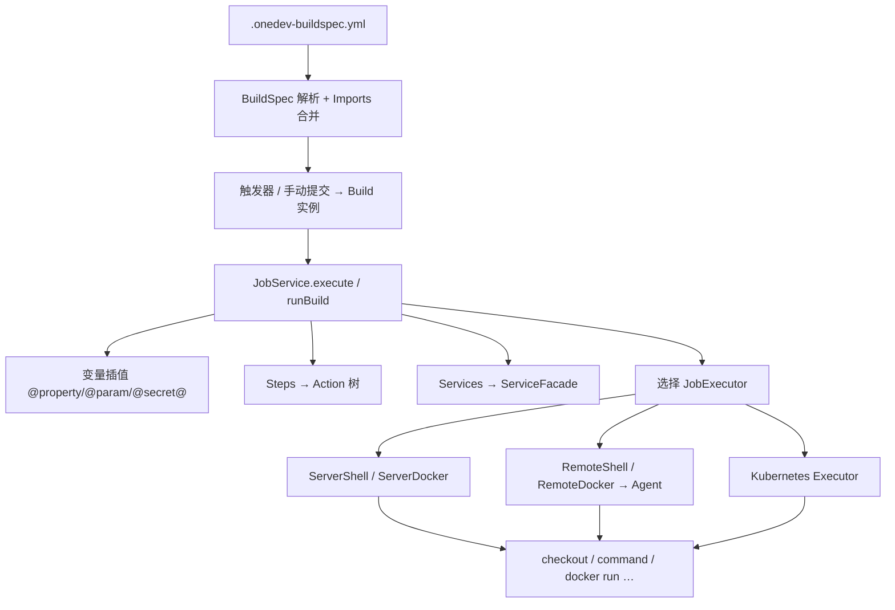

# OneDev Builds 执行架构

`.onedev-buildspec.yml` 里的 **Jobs / Services / Step Templates / Properties / Imports** 是声明式配置，**不会被直接执行**。BuildX / OneDev 使用自研的 **Job 调度 + 可插拔 Executor +（可选）Agent 工作节点** 来跑 CI。

概念说明见 [onedev-builds-concepts.md](onedev-builds-concepts.md)。

---

## 一句话

buildspec 被 **Job Service** 解析、合并、插值后，转成 **Action 执行计划**，再交给某个 **Job Executor** 在服务器本机、远程 **Agent** 或 **Kubernetes** 上执行。

---

## 执行链路



OneDev 入口：`references/onedev/server-core/src/main/java/io/onedev/server/job/DefaultJobService.java` 的 `execute(Build)`。

BuildX 对应：`buildx-server/internal/job/service.go` 的 `runBuild`。

---

## 分层职责

| 组件 | 职责 | 常见类比 |
|------|------|----------|
| **Job Service** | 提交 Build、等 Job 依赖、插值、选 executor、收日志、更新状态 | GitLab Runner coordinator / Jenkins master |
| **JobExecutor**（插件） | 决定**在哪、用什么运行时**跑 job | Runner executor 类型 / Jenkins agent label |
| **Agent**（`io.onedev.agent`） | 远程 worker 进程，WebSocket 长连 server，接收 job 并本地执行 | GitLab Runner / Jenkins agent |
| **Action / Facade**（`k8shelper`） | Step 编译后的中间表示（checkout、command、run container…） | 内部 IR / Tekton step 计划 |
| **实际运行时** | shell、Docker 容器、K8s Pod | 与上表 executor 类型对应 |

YAML 五 Tab（Jobs / Services / Templates / Properties / Imports）描述**配置**；Executor 描述**运行环境**；二者通过 Job Service 衔接。

---

## JobExecutor 类型（OneDev）

Executor 在管理后台配置，Job 可通过 `jobExecutor` 字段指定名称；留空则使用**第一个 `isApplicable` 且已启用**的 executor。

| Executor | 运行位置 | 参考路径 |
|----------|----------|----------|
| **Server Shell** | OneDev 服务器本机 shell（权限等同 server 进程） | `server-plugin-executor-servershell` |
| **Server Docker** | 服务器上 Docker 容器 | `server-plugin-executor-serverdocker` |
| **Remote Shell** | 远程 Agent 上 shell | `server-plugin-executor-remoteshell` |
| **Remote Docker** | 远程 Agent 上 Docker | `server-plugin-executor-remotedocker` |
| **Kubernetes** | K8s Pod | `server-plugin-executor-kubernetes` |

Remote 类 executor 将 `ShellJobData` / `DockerJobData` 经 WebSocket 发给已连接的 Agent；Agent 侧与 server 侧共用 `k8shelper` Action 语义和 `io.onedev.agent.job` 工具库。

---

## 各 buildspec 元素何时生效

| 元素 | 生效阶段 | 消费者 |
|------|----------|--------|
| **Imports / Properties** | 解析 buildspec | 合并进 BuildSpec，供插值 |
| **Step Templates** | 解析时（`UseTemplateStep` 展开） | 变成普通 Steps，再转 Actions |
| **Services** | Build 运行时 | Executor 编排 sidecar（hostname = service name） |
| **Steps** | Build 运行时 | 各 Step 类型的 `getAction()` / `getFacade()` |

**Server-side Step**：部分步骤即使 job 在 Agent 上跑，也会回调 OneDev 服务器执行（访问 server 上 git、缓存、集群资源等），见 `DefaultJobService.runServerStep`。

---

## Step → Action 示例

`CommandStep` 经插值后生成 `CommandFacade`（是否 `runInContainer`、image、interpreter 命令等）。Executor 遍历 Action 树，按 facade 类型执行 checkout、跑脚本、起容器、发布产物等。

`DefaultJobService.execute` 核心逻辑（概念上）：

1. 遍历 Job 的 steps → `actions`
2. 按 `requiredServices` → `ServiceFacade` 列表
3. 应用 timeout、job token、commit/ref
4. 调用选中的 `JobExecutor.execute(JobContext, logger)`

---

## BuildX 迁移状态

| OneDev | BuildX | 状态 |
|--------|--------|------|
| `io.onedev.server.buildspec` | `internal/buildspec/` | 已迁移（解析、imports 合并等） |
| `DefaultJobService` | `internal/job/` | 调度与状态机已有；执行路径简化中 |
| `JobExecutor` 插件 | `internal/executor/` | 接口 + `ServerShellExecutor`；Remote/K8s 待接 |
| Agent WebSocket | `internal/agent/runtime/` | 注册、心跳、会话管理进行中 |
| Step → 全量 Action 树 | — | **进行中**：当前 `runBuild` 仅 `extractCommands` 处理 `CommandStep` |

完整 parity 还需 port：Checkout、UseTemplate、各类 Docker/产物/扫描 Step，以及 Remote Docker / K8s executor。

---

## 与其他 CI 的对照

```
buildspec YAML     ≈  .gitlab-ci.yml / Jenkinsfile（声明）
Job Service        ≈  Coordinator / Master（调度）
JobExecutor        ≈  Runner executor（shell / docker / k8s）
Agent              ≈  Runner 进程（长连 server）
Step → Action      ≈  将 step 编译为内部执行计划
Service            ≈  GitLab services: / GHA services:
```

OneDev 特点：**GUI 五 Tab 与 YAML 顶层结构对齐**；**同一套 Step 语义**通过 Action IR 在 server / agent / K8s 间复用。

---

## 参考源码

| 主题 | OneDev |
|------|--------|
| Job 调度与 execute | `server-core/.../job/DefaultJobService.java` |
| Step → Action | `server-core/.../buildspec/step/Step.java` 及各 Step 子类 |
| Action / Facade IR | `references/k8s-helper`（`io.onedev.k8shelper.*`） |
| Server Shell Executor | `server-plugin-executor-servershell/.../ServerShellExecutor.java` |
| Remote Shell Executor | `server-plugin-executor-remoteshell/.../RemoteShellExecutor.java` |
| BuildX Job Service | `buildx-server/internal/job/service.go` |
| BuildX Executor | `buildx-server/internal/executor/` |

---

## 相关文档

- [onedev-builds-concepts.md](onedev-builds-concepts.md) — buildspec 概念（Jobs、Services、Templates 等）
- [ARCHITECTURE.md](ARCHITECTURE.md) — BuildX 模块映射与 executor 规划
- [ROADMAP.md](ROADMAP.md) — CI/Build 迁移阶段
- OneDev 官方：[CI/CD 概念](https://docs.onedev.io/concepts)
