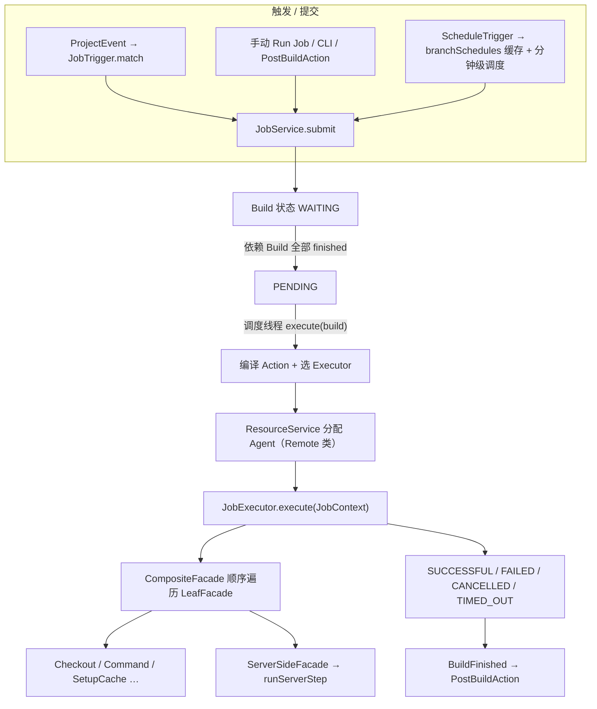
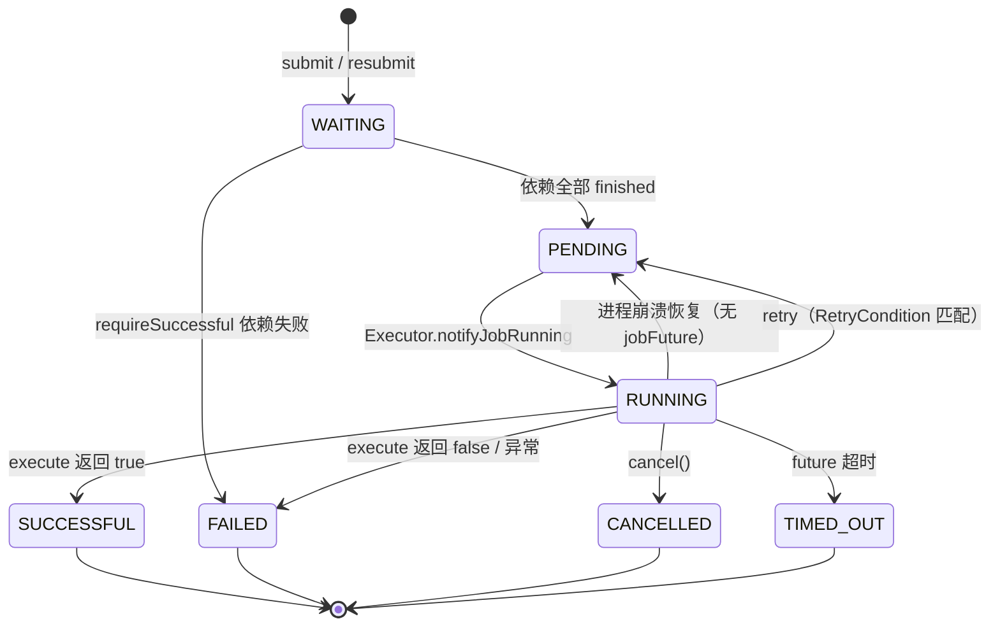

# OneDev Builds 执行架构

`.onedev-buildspec.yml` 里的 **Jobs / Services / Step Templates / Properties / Imports** 是声明式配置，**不会被直接执行**。OneDev 使用自研的 **Job Service 调度循环 + 可插拔 JobExecutor +（可选）Agent 工作节点 + k8shelper Action IR** 来跑 CI。

概念说明见 [onedev-builds-concepts.md](onedev-builds-concepts.md)。

---

## 一句话

Build 提交后进入 **WAITING → PENDING → RUNNING** 状态机；Leader 节点上的调度线程发现可执行 Build，调用 `DefaultJobService.execute` 将 Job 的 Steps 编译为 **Action 树**，再交给选中的 **JobExecutor** 在服务器本机、远程 **Agent** 或 **Kubernetes Pod** 上执行。

---

## 端到端执行链路



**核心入口**

| 阶段 | OneDev | BuildX（迁移中） |
|------|--------|------------------|
| 提交 | `DefaultJobService.submit` | `internal/job/service.go` → `Submit` |
| 调度 | `DefaultJobService.run`（`Runnable` 后台线程） | `internal/job/scheduler_loop.go` → `StartScheduler`（PENDING 轮询，无 Leader 集群） |
| 编译 | `step.getAction` → Action 树 | `internal/execplan` → `CompileJob` |
| 执行 | `DefaultJobService.execute` | `runBuild` → `JobExecutor.ExecutePlan` |

---

## Build 提交与触发

### 提交（`submit`）

`DefaultJobService.submit` 在 `(project, commit, jobName, params, ref, PR/issue)` 维度加锁，保证同一组合不会重复创建 Build：

1. 读取 commit 上的 `BuildSpec`，校验 schema（`validator.validate`）
2. 若 **不存在** 相同参数的 Build → 创建新 Build（`Status.WAITING`），写入 `BuildParam`，递归 `doSubmit` **JobDependency** 依赖 Job，解析 **ProjectDependency** 引用其他项目的 Build
3. 若 **已存在** → 直接返回已有 Build（幂等）
4. `buildSubmitted`：清空 build 目录、发布 `BuildSubmitted` 事件
5. 事务提交后异步：取消同一 `(job, ref, PR/issue, params)` 下 **更旧且未完成** 的 Build（PR 场景或 commit 已 merge 进当前 commit 时）

手动提交、CLI、Post-build `RunJobAction` / `RunProjectJobAction` 均走同一 `submit` 路径。

### 自动触发

`DefaultJobService.on(ProjectEvent)` 监听项目事件（如 `RefUpdated`、PR 事件、Issue 状态变更等）：

- 读取 commit 的 buildspec，对每个 Job 调用 `job.getTriggerMatch(event)`
- 匹配成功则 `resolveParams` 展开 `paramMatrix`，对每个参数组合调用 `submit`
- **定时触发**：`ScheduleTrigger` 的 cron 表达式在分支 push 时缓存到 Hazelcast `branchSchedules`；系统启动后每分钟由 Leader 检查并 submit/resubmit

触发器类型见 `buildspec/job/trigger/`（`BranchUpdateTrigger`、`PullRequestUpdateTrigger`、`ScheduleTrigger`、`DependencyFinishedTrigger`、`IssueInStateTrigger` 等）。

---

## Build 状态生命周期



| 状态 | 含义 | 典型进入条件 |
|------|------|--------------|
| **WAITING** | 已提交，等 Job/Project 依赖 | `submit` 创建 |
| **PENDING** | 依赖满足，等待调度分配 Executor | 调度线程检查依赖 |
| **RUNNING** | Executor 已开始执行 | `JobExecutor.notifyJobRunning` |
| **SUCCESSFUL / FAILED / CANCELLED / TIMED_OUT** | 终态 | `execute` 完成、`cancel`、超时 |

**调度循环**（`DefaultJobService.run`，仅 **Leader** 节点）：

- 每 ~5 秒（或 `BuildSubmitted` / `BuildPending` / `BuildFinished` 时立即）扫描 `queryUnfinished()`
- 按项目的 **active server** 分发到对应集群节点执行状态迁移
- `WAITING` → 检查 `BuildDependence`：全部 finished 则 → `PENDING`；`requireSuccessful` 依赖失败则直接 `FAILED`
- `PENDING` → 若无在途 `jobFuture`，调用 `execute(build)`
- `RUNNING` 但无 `jobFuture` → 视为崩溃，重置为 `PENDING`（清空 checkoutPaths 等）
- `execute` 的 `Future` 完成后在本节点更新终态并发布 `BuildFinished`

Build 还可标记 `paused`（日志指令 `PauseExecution` 或 UI 恢复），Executor 通过 `generatePauseCommand` 在步骤间阻塞直至 `resume`。

---

## 分层职责

| 组件 | 职责 | 常见类比 |
|------|------|----------|
| **Job Service** | 提交、依赖 DAG、调度循环、插值、选 Executor、Server Step 回调、日志/状态 | GitLab Runner coordinator / Jenkins master |
| **JobExecutor**（插件） | 决定**在哪、用什么运行时**跑 job；设置 RUNNING | Runner executor 类型 |
| **ResourceService** | Remote Executor 的 **Agent 选择与并发槽位**分配 | Runner 注册 + 并发限制 |
| **Agent**（`io.onedev.agent`） | 远程 worker，WebSocket 长连，接收 `ShellJobData` / `DockerJobData` | GitLab Runner / Jenkins agent |
| **Action / Facade**（`k8shelper`） | Step 编译后的 IR（`CompositeFacade` + 各类 `LeafFacade`） | 内部执行计划 / Tekton steps |
| **WorkerResource**（`/~api/worker`） | Agent/K8s worker 拉 job 数据、跑 server step、上传/下载 cache | Worker ↔ server 内部 API |
| **RunCacheService** | 项目级 job cache 存储与查找（key + checksum） | GitLab cache / Actions cache |
| **LogService** | 按 build 持久化日志、实时 listener、secret 掩码 | CI 日志后端 |

YAML 五 Tab 描述**配置**；Executor 描述**运行环境**；Job Service 在运行时衔接二者。

---

## JobExecutor 类型

Executor 在管理后台配置。Job 可通过 `jobExecutor` 字段指定名称（支持 `@property:` 插值）；留空则使用配置列表中**第一个 `isEnabled && isApplicable`** 的 executor；若列表为空则按 `JobExecutorDiscoverer` 扩展点**自动发现**（如本机 Server Shell）。

| Executor | 运行位置 | 需 Docker | 参考模块 |
|----------|----------|-----------|----------|
| **Server Shell** | OneDev 服务器本机 shell | 否（不支持 `requiredServices`） | `server-plugin-executor-servershell` |
| **Server Docker** | 服务器 Docker | 是 | `server-plugin-executor-serverdocker` |
| **Remote Shell** | 远程 Agent shell | 否 | `server-plugin-executor-remoteshell` |
| **Remote Docker** | 远程 Agent Docker | 是 | `server-plugin-executor-remotedocker` |
| **Kubernetes** | K8s Pod（含 sidecar services） | 是（Pod 内） | `server-plugin-executor-kubernetes` |

**适用性（`isApplicable`）** 综合判断：

- Executor 的 **jobMatch** 查询（项目/分支/Job 名等，见 `JobMatch`）
- Job 每个 Step 的 `step.isApplicable(build, executor)`
- 若 Job 声明 **requiredServices**，Executor 必须实现 `DockerAware`
- PR Build：source 与 target 项目的 `JobMatchContext` 均须匹配

Remote 类 executor 通过 `ResourceService.submitAgentTask` 选择在线且未 pause 的 Agent（`AgentQuery`），在 Agent 所在 server 上占用 `agentId:executorName` 并发槽，经 WebSocket 下发 job 数据；Agent 与 server 共用 `k8shelper` Action 语义。

---

## Step → Action 编译与执行

### 编译时机（`execute` 内）

`DefaultJobService.execute` 在 **Build 即将 RUNNING 之前**（实际进入 executor 前）完成：

1. `JobVariableInterpolator` 插值 `@property:` / `@param:` / `@secret:` 等
2. 遍历 Job Steps → 每步 `step.getAction(...)` 得到 `Action`（含 `ExecuteCondition`、`optional`）
3. **UseTemplateStep** 在此展开：`CompositeStep.getActions` 解析模板、`paramMatrix` 多组参数，递归生成子 Action（**非** YAML 解析阶段）
4. `requiredServices` → `ServiceFacade` 列表
5. 组装 `JobContext`（actions、services、timeout、secretMasker、projectGitDir…）

每个 `Action` 包装一个 `StepFacade`；`CompositeFacade.traverse/execute` 按顺序执行 leaf，支持 **SUCCESSFUL 条件** 与 **optional** 步骤跳过。

### LeafFacade 类型（节选）

| Facade | 典型 Step | 执行位置 |
|--------|-----------|----------|
| `CheckoutFacade` | CheckoutStep | Executor 本地 git clone |
| `CommandFacade` | CommandStep | shell 或容器内脚本 |
| `SetupCacheFacade` | SetupCacheStep | download/upload cache（经 cache provisioner） |
| `ServerSideFacade` | PublishArtifactStep、SetBuildVersionStep 等 | **Server**（`runServerStep`） |
| `BuildImageFacade` / `RunContainerFacade` | BuildImageStep、RunContainerStep | Docker/K8s executor |
| `ServiceFacade` | buildspec `services:` | Docker/K8s sidecar 编排 |

**Server-side Step**：`ServerSideStep.getFacade` 生成 `ServerSideFacade`。无论 job 跑在 Agent 还是 K8s，worker 通过 `WorkerResource.runServerStep`（Bearer job token）回调 OneDev 服务器执行（访问 server 上 git、artifacts、DB 等）。多 server 集群时 `runServerStep` 可转发到 project 的 **active server**。

**CommandStep 容器模式**：`runInContainer=true` 时生成带 `image` 的 `CommandFacade`，仅 Docker/K8s executor 可执行；Shell executor 会报错。

---

## 依赖、产物与 Cache

### Job / Project 依赖

- **JobDependency**（同 commit）：submit 时递归 submit 依赖 Job，建立 `BuildDependence`；执行前 `copyDependencies` 将依赖 Build 的 artifacts 按 pattern 复制到工作目录
- **ProjectDependency**：引用其他项目已有 Build 的 artifacts（需 access token 或匿名权限）

### 产物（Artifacts）

`PublishArtifactStep`（`ServerSideStep`）在步骤执行时将工作目录文件复制到 `StorageService.initArtifactsDir(projectId, buildNumber)`，供 Build 详情页与后续 Job 依赖使用。

### Job Cache

`SetupCacheStep` 定义 cache key、checksum 文件、路径、upload 策略（如 `UPLOAD_IF_NOT_EXACT_MATCH`）。执行时：

- **查找**：沿项目树向上按 `(key, checksum)` 匹配（exact / partial）
- **下载/上传**：Executor 侧 `CacheProvisioner` + `RunCacheService`；Remote/K8s worker 经 `WorkerResource` / `ClusterResource` HTTP 端点传输 tar 流

---

## 日志

- 每个 Build 有 `BuildLoggingSupport`（projectId + buildNumber 标识）
- Executor 内使用 `TaskLogger`；Remote/K8s 场景 worker 侧用 `ServerLogger` 将日志 POST 回 active server
- 支持 **secret 掩码**、按 offset 读取、实时 `LogListener`
- 日志内嵌指令：`SetBuildVersion`（更新 build version）、`PauseExecution`（暂停 build）

---

## 重试、取消、重新提交

| 操作 | 行为 |
|------|------|
| **Retry** | Job 配置 `retryCondition`（默认 `never`）、`maxRetries`（默认 3）、`retryDelay`（默认 30s，指数退避 `delay * 2^retried`）。匹配时将 Build 重置为 `PENDING`，清空 checkoutPaths |
| **Cancel** | 在 project active server 上 `jobFuture.cancel(true)`，终态 `CANCELLED`，记录 canceller |
| **Resubmit** | 仅 finished Build：重置 token/日期/状态为 `WAITING`，递增 `submitSequence`，递归 resubmit 依赖 Build |
| **Sequential group** | Job 的 `sequentialGroup` + executor 名组成 Hazelcast 锁 key，同组 job 串行执行 |

---

## 构建完成后

`BuildFinished` 事件触发 `PostBuildAction`（按 `ActionCondition` 过滤）：如 `CreateIssueAction`、`SendNotificationAction`、`RunJobAction`、`RunProjectJobAction`。

---

## 集群与多 Server

OneDev 支持多 server 集群（Hazelcast）：

- `jobServers` / `jobContexts`：job token → 执行节点映射，供 `runServerStep`、shell 终端路由
- 每个 project 有 **active server**；unfinished build 调度到 active server
- Agent 注册在某一 server；`submitAgentTask` 在 agent 所属 server 上执行 runnable
- Leader 负责全局 unfinished 扫描与 `jobServers` 垃圾回收

---

## 各 buildspec 元素何时生效

| 元素 | 生效阶段 | 消费者 |
|------|----------|--------|
| **Imports / Properties** | 读取 buildspec 时 | 合并进 `BuildSpec`，供插值 |
| **Step Templates** | **`execute` 编译 Action 时**（`UseTemplateStep.getActions`） | 展开为普通 Step 的 Action 列表 |
| **Services** | Build 运行时 | Docker/K8s Executor 编排 sidecar（hostname = service name） |
| **Steps** | Build 运行时 | `step.getAction()` → Facade 树 |
| **Triggers** | 项目事件 / 定时调度 | `DefaultJobService.on(ProjectEvent)` / branchSchedules 任务 |
| **JobDependencies / ProjectDependencies** | submit + execute 前 | submit 建 DAG；execute 前 copy artifacts |
| **PostBuildActions** | Build 终态后 | `on(BuildFinished)` |

---

## BuildX 迁移状态

| OneDev | BuildX | 状态 |
|--------|--------|------|
| `io.onedev.server.buildspec` | `internal/buildspec/` | 已迁移（解析、imports、job/step/trigger 等） |
| `DefaultJobService` 提交 + 状态机 | `internal/job/` | `Submit`、DAG 依赖提交、`WAITING→PENDING` 调度、`Resubmit`、retry、PostBuildAction（RunJobAction） |
| `DefaultJobService.execute` | `runBuild` | Action 树 + `ExecutePlan`；checkout/cache/server-step；retry；sequential group 锁 |
| `JobExecutor` 插件 | `internal/executor/` | `ServerShellExecutor`；`RemoteShellExecutor` + WebSocket `ExecutePlan`；`DockerExecutor`（Docker CLI） |
| Step → Action / ServerStep | `internal/execplan/` + `executor/` | Command/Checkout/SetupCache/RunContainer/BuildImage/PullImage/PushImage/ServerSide facades |
| Cache / Artifacts | `internal/cache/` + `internal/artifact/` | cache tar + publish/copy + `GET .../artifacts` 列表/下载 |
| 触发器 | `internal/job/triggers.go` + `schedule.go` | Branch/PR + branchSchedules 缓存 + 分钟 tick |
| Agent / Worker API | `internal/agent/` + `internal/worker/` + `cmd/buildx-agent` | WebSocket `executePlan`；agent 本地执行 plan；`/~api/worker/*` |
| ResourceService | `internal/resource/` | Agent 查询、并发槽、pause 过滤 |
| K8s / remote-docker | `internal/executor/kubernetes.go`, `remotedocker.go` | 骨架（kubeconfig / agent 分配） |
| 集群 / active server 路由 | — | **未开始** |

完整 parity 还需：K8s helper 完整 Pod 执行、Java 二进制 Worker 协议兼容、完整 retryCondition 表达式、SendNotification post-build、日志 DB 持久化、集群 Leader 路由、Build 提交幂等锁与崩溃恢复。

**BuildX 估计 parity：~78–82%**（buildx-agent + ResourceService + services sidecar + 更多 server/post-build/log 能力；K8s 完整执行与集群仍为缺口）。

---

## 与其他 CI 的对照

```
buildspec YAML     ≈  .gitlab-ci.yml / Jenkinsfile（声明）
Job Service        ≈  Coordinator / Master（调度 + 状态机）
JobExecutor        ≈  Runner executor（shell / docker / k8s）
Agent              ≈  Runner 进程（长连 server）
Step → Action      ≈  将 step 编译为内部执行计划
Service            ≈  GitLab services: / GHA services:
Job cache          ≈  GitLab cache / Actions cache
Server-side step   ≈  回调 coordinator 的 hook（无直接等价）
```

OneDev 特点：**GUI 五 Tab 与 YAML 对齐**；**同一套 Step/Facade 语义**在 server / agent / K8s 间复用；**Server-side Step** 使产物发布、版本设置等始终在有 DB/git 访问权的 server 上执行。

---

## 参考源码（OneDev）

| 主题 | 路径 |
|------|------|
| Job 调度、submit、execute、run 循环 | `server-core/.../job/DefaultJobService.java` |
| Job 接口 | `server-core/.../job/JobService.java` |
| Build 状态枚举 | `server-core/.../model/Build.java` |
| Step → Action | `server-core/.../buildspec/step/Step.java`、各 Step 子类 |
| UseTemplate 展开 | `server-core/.../buildspec/step/UseTemplateStep.java` |
| Action / Facade IR | `references/k8s-helper`（`io.onedev.k8shelper.*`） |
| Job 定义（retry/sequential/timeout） | `server-core/.../buildspec/job/Job.java` |
| 触发器 | `server-core/.../buildspec/job/trigger/` |
| Executor 基类 | `server-core/.../jobexecutor/JobExecutor.java` |
| Server Shell Executor | `server-plugin-executor-servershell/.../ServerShellExecutor.java` |
| Remote Shell Executor | `server-plugin-executor-remoteshell/.../RemoteShellExecutor.java` |
| Kubernetes Executor | `server-plugin-executor-kubernetes/.../KubernetesExecutor.java` |
| Agent 任务分配 | `server-core/.../service/impl/DefaultResourceService.java` |
| Worker 内部 API | `server-core/.../rest/resource/WorkerResource.java` |
| Job cache | `server-core/.../service/RunCacheService.java`、`.../step/SetupCacheStep.java` |
| 产物 | `server-core/.../step/PublishArtifactStep.java` |
| 日志 | `server-core/.../logging/LogService.java`、`BuildLoggingSupport.java` |
| Post-build | `server-core/.../buildspec/job/action/` |

**BuildX 对应**

| 主题 | 路径 |
|------|------|
| Job Service | `buildx-server/internal/job/service.go` |
| 状态机 | `buildx-server/internal/job/statemachine.go` |
| Executor | `buildx-server/internal/executor/` |
| Agent 运行时 | `buildx-server/internal/agent/runtime/` |
| Worker 内部 API | `buildx-server/internal/worker/` |
| Agent 协议 | `buildx-server/internal/agent/protocol/`、`internal/agent/jobdata/` |
| BuildSpec | `buildx-server/internal/buildspec/` |

---

## 相关文档

- [onedev-builds-concepts.md](onedev-builds-concepts.md) — buildspec 概念（Jobs、Services、Templates 等）
- [ARCHITECTURE.md](ARCHITECTURE.md) — BuildX 模块映射与 executor 规划
- [ROADMAP.md](ROADMAP.md) — CI/Build 迁移阶段
- OneDev 官方：[CI/CD 概念](https://docs.onedev.io/concepts)、[Job cache 教程](https://docs.onedev.io/tutorials/cicd/job-cache)
